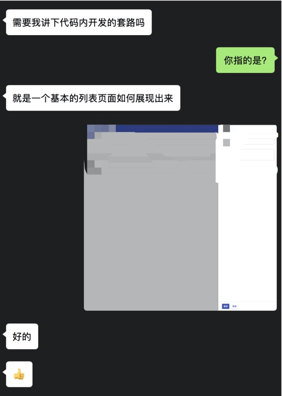
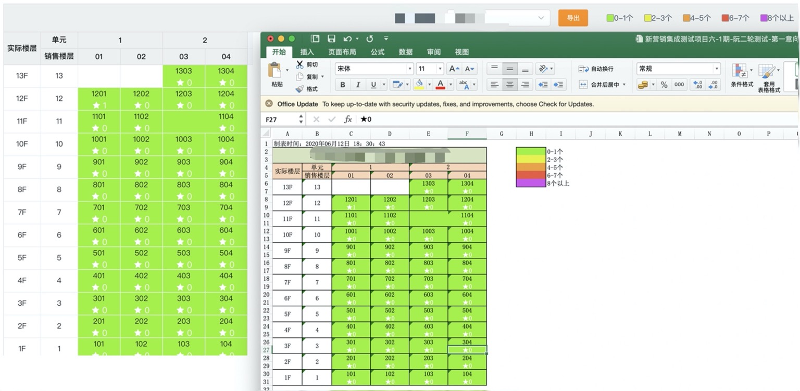

# 谈谈我成为前端的这两年
## 初来深圳
2018年5月份初，面试过了现在的公司，但过来以后是做前端开发，临近毕业没有 Offer，刚一毕业答辩完，就跑来深圳干活了。

还记得是2018年5月16日星期三下午，跟一个同学，两个人背着个背包，拖着个行李箱，就到了深圳。先是安排了住处，然后接头的人大概的说了一下周边情况，然后我俩逛了一下，买了点生活用品，吃了个晚饭，第一天就这么过去了。在来的路上因为知道项目上用的是 React，所以在来之前，自己也先看了一下 React 官网的快速入门教程。

## 最初工作状态
第二天上午安排入职，然后是安排工作。TL 先是安排了我同学到一个项目上，然后把我安排到了我老大手下，介绍了一下我老大，说接下来就是他带你了。然后老大丢给我6还是7个link，包括 React、Antd、Webpack、Mobx、React-Router、ES6等这些项目上用到的技术，剩下的就是自己看资料学习了。

星期三下午到深圳，星期四入职，接下来星期五自己看资料，过周末，到了下周一5月21日，就被自己安排到了项目上开始干活。被分配了一个页面，老大说跟 XXX 页面一样，然后我就开始了复制粘贴改改改的日子。

这时候复制的也是我老大刚开始写前端时候的代码，spread 和 rest 语法都不会用，操作对象也不会，一个 `res = { a, b }` 这样后端返回的对象，会在代码中再定义一个对象 `obj`，然后 `obj.a = res.a; obj.b = res.b;`，用这样的形式去操作对象。后来去其他项目跟组里其他前端同事聊天时，还被吐槽光赋值代码就400多行，最后他重写了。

## 成为前端的这两年
最开始也是一个前端小白（PS：不过这个小白并不是什么都不懂，只是 React 这种开发方式上不了解，在学校里也是能用 `jQuery` 实现各种效果的），然后算是 TL 比较器重，各种小项目都交给我来负责，比较大的项目也更相信我的能力。

### 人天管理系统
在第一个项目写了 400 行恶心的赋值代码以后，不到3周的时间，我就被撤掉了，后面一段时间主要是负责客户这边的人天管理系统的运维，以及实现 TL 的各种想法。

记得当时为了实现一个餐补功能，自己觉得开发的没什么问题了让 TL 测试，结果刚开始就出了问题，调完觉得应该没什么问题了，结果 TL 随便点了一下，又出了 bug，他说：“你多测试一下再叫我”。这个 bug 改了以后，各种测试功能，自己觉得没什么问题了，但是不敢叫 TL 复测。

最后还是让他测试，依旧有 bug，反反复复到了凌晨1点总算没有问题了，结果发版部署的时候又出了问题，不过这一次不是我的问题了，具体原因是配置上有点问题。调试这个部署问题的时候，TL 说要我本地拉生产环境的代码测试一下，我试了几个以后说拉不下来，还被吐槽拉生产都不会。后面有点小插曲，就不多说了=。=。

### 短信平台
过了一段时间，客户这边需要接入短信平台，然后我就被安排做这个短信平台的前端，虽然做了两个项目，但是好笑的是，我并不会新建一个前端项目=。=，`clone` 我老大搭好的前端项目，然后就直接继续开发短信平台的相关功能。这个项目上的插曲比较少，顶多就是有一些 bug，然后修 bug。

这个项目上有记忆的点就是如果某个请求失败了，需要中断其他已经发送的请求。用 `axios` 的 `cancelToken`实现了，但是会导致后续所有请求都不能发送了。=。=不过我也忘了后来是怎么做的了，因为我又被安排做下一个项目了。

### 资金计划
在这个项目上做 Java 开发，项目主要处于运维阶段，主要负责 bug 的修复、系统优化以及一些新功能的实现。

亮眼一点的地方就是 Excel 导入导出相关，还有就是一段统计 SQL 的优化。

Excel 的导入主要就是数据格式的处理和验证，导出主要是能原样实现界面上的展示效果以及客户想要的显示效果，技术难度上也没啥特别的难点，就是在找 KendoUI 的资料的时候，是真的想吐槽。当时为了解决导出文件打开时有一个提示，真的是翻遍了 KendoUI 论坛 Excel 相关搜索结果的文章了。

SQL优化这块，因为是统计SQL，查询时长太久了，我主要做的是分享具体哪段 SQL 导致了执行结果过长，然后想办法用其他方式优化查询时间。当时的问题是在 SELECT 部分，进行了一些其他表的查询，后来我用了连表的形式，优化的结果挺明显的，简历里写的是查询时间缩短为原SQL的十分之一，没记错的话，似乎是从400多秒缩短到了40多秒这样？从结果上来看，页面 loading 时间明显缩短。

### OSP/OPEN API
这段记忆已经比较模糊了，都不太记得自己具体做过什么了，印象里只记得在 OPEN API 项目上，有个表单部分的联动自己做的还可以，其他的没什么印象了。

### 招采管理
这个项目是我第一年里，比较重点的一个项目了吧，算是真正的从零开始接触一个前端项目。不过这个是后的我，经验依旧不强，整个项目的搭建是由其他同事的负责，我主要还是实现业务功能。这个项目记得的就只有一个富文本编辑器的实现，=。=因为写这个功能的时候，我的任务比较少了，后端忙不过来，我就跑去把后端的初版给写了，相关的模块前后端都是我自己实现了，不过后来的后端维护，就是交给其他后端同事维护了。

这个项目分为两大块，在我负责的这一大块里，TL 比较信赖我一点，反正就是事情交给我比交给其他人放心一些，而那些几年经验的都被丢去做另一大块了。

这个项目里还有一个就是负责上传功能，然后封装了第一版的组件，然后其他相关的上传组件都是基于我这套代码去扩展或者以我的代码作为副本去扩展。

然后这个项目让我发现，及时是用 Antd 这样的 UI 框架，依旧得进行再封装，这样在统一一些基础属性的时候更方便，在接下来的我作为前端负责人的时候，就开始实施这一点。

--- 

### 小结

从2018年5月中旬，到2019年3月，这一段时间里，我只是作为一个“初/中”级前端去实现业务功能，在独立实现相关功能，依旧代码质量上不断提高。

在这些项目的喂养下，知道一个前端项目会由基础开发框架(React/Vue)、路由管理模块、状态管理这一些部分组成。知道在一个现有脚手架的基础上，要怎么写一个页面代码，以及如何让页面展示出来。可是相应的，因为都是实际上手做事，所以基础知识上的系统学习不多，基本到了够用即可的地步。=。=导致我面试结果都是沟通表达能力尚可，基础不扎实这样的结果。

👆这段文字的效果大概就是，2019年2月份被安排做一个新项目，技术栈是公司内部的框架，要求实现两个简单的页面，任务刚下来，然后我在系统中找了类似的页面，然后直接就给开发出来了。本来安排要个几天，但是我花了两三个小时？就搞完了吧。具体结果看图。

---  

### 住宅营销项目
这个项目是我从2019年3月至今(2020年6月)在做的项目，这个项目算是让我真正成长的一个项目。这个项目我被安排为前端负责人，项目刚开始的时候，同组有两个三年工作经验的前端。后来这个项目前端来了又走，最多的时候有七八个(含两个实习生)，到现在还剩2个人，感概颇多。

在我被前面那些项目喂养过后，了解了一个前端项目大概有哪些部分，然后花了三天，把 Vue、Vue-Router、Vuex三个官网的教程部分基本全过了一遍，Vue 的风格指南、API，Vue-Router的 API 参考，以及Vuex的 API 参考大致过了一下，然后就去搭项目了。当时最开始是要迁移一个现有项目，选择 Vue 也是因为考虑复用原项目的一些代码，那时候 Vue-Cli 的最新版本是3，作为一个不太熟项目搭建这一块的我，对比了3和2的项目结构，最后选择了2，因为2的项目结构与原项目相同，很多东西可以对比分析。

这个项目上，根据招采项目的经验，对 ElementUI 做了基础扩展，包括`el-table`、`el-input`、`el-form`等，都进行了扩展。

也封装了一些组件，比如项目最开始的时候，两个三年工作经验的同事，表格以及表格分页全都是一个页面复制粘贴一套，然后我就封装了 `table` 和 `pagenation` 组件，并且将 `el-table` 扩展成可以通过 `columns` 配置的。

整个住宅营销系统主要数据源就是房间，我负责整个房间组件的实现及维护，其中重点业务需求是要求房间表格可以实现选中任意相邻的单元格进行合并，甚至合并出了一个❤️给客户看=。=。因为主要是我开发的，后续房间数量多的情况下的表格渲染、交互性能都是我去处理。还有合并后的房间表格要能够原样导出 Excel 表格，或者是导出成图片形式。

这个项目做了一年零三个月，现在回过头来看，已经觉得没有什么难的东西在里面，主要是页面交互中，要保证各种数据的合理性，这一点非常恶心，整个这个项目看起来很容易，但做起来就是非常恶心。

在这里很感谢这个项目上的那些前端小伙伴，毕竟整个项目是在大家一起努力下完成的，=。=不过U1S1，我的代码就是稍微好一点。

## 总结
🙃写到这里，感觉累了，回过头来看这两年，有成长，但似乎也并不理想，也没什么可以说道的。这两年，用我 TL 的话来说，“我的实力属于高级顾问的实力”，但是出去面试被啪啪打脸。我也知道我的问题所在，能干实事，但是面试上说道一二三的时候，就拉垮了，群里的小伙伴们也认可我的实力，可面试就是造火箭。后面的路，再慢慢走吧。

在这一系列文章里，也是不断总结自己，不断寻找未来的道路。如果我走过的路，能帮到一些人，想想也是挺好的。

我是 Wetoria，与你在这条路上一起加油。