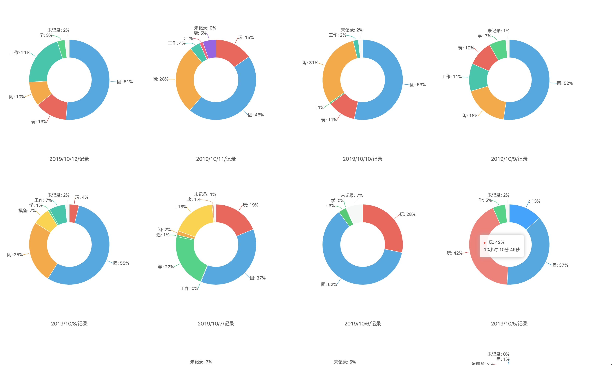
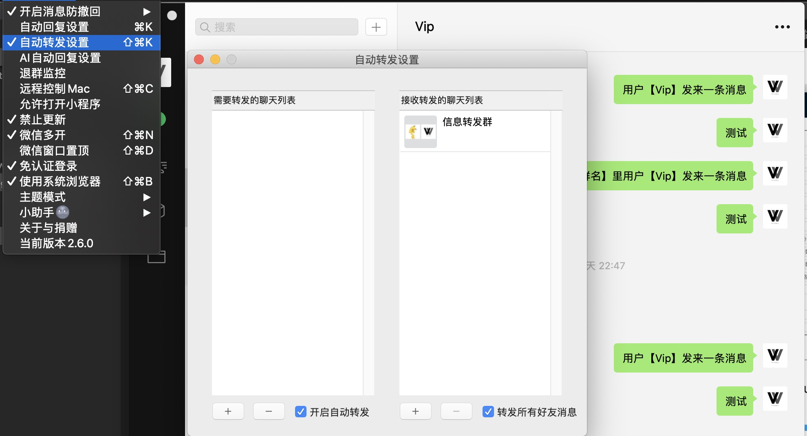
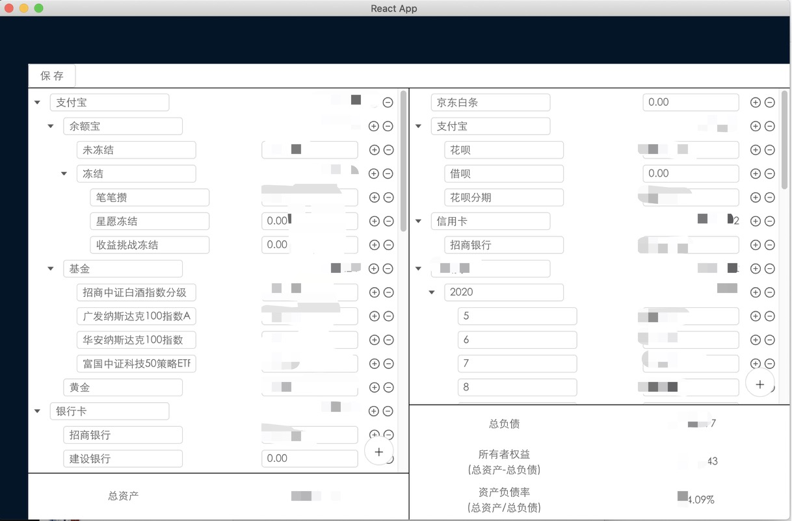
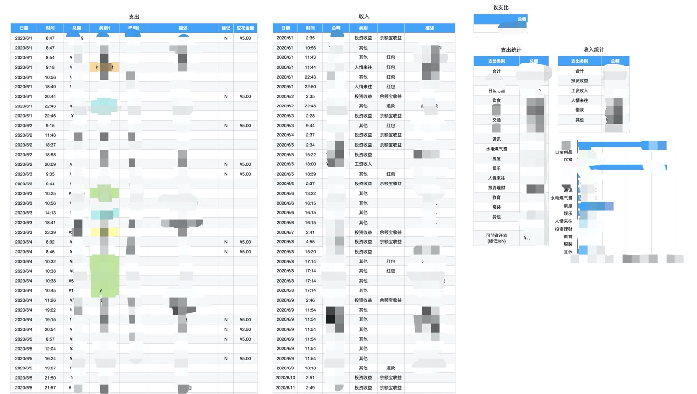
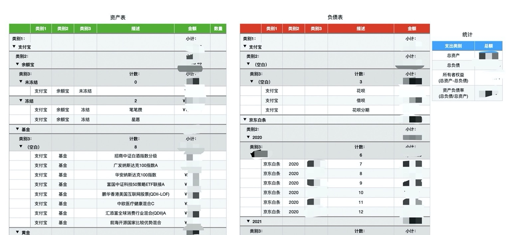

这遍文章用来说说我平时都做些什么。

## 程序人生

## 工具

我现在主要工作是做前端开发，但是我给自己的定位不限于前端的程序员。而我理解的程序员，是能够通过使用工具达成自己的目标。

这样的我，为了更好的记录自己的时间开销，用《[iOS13正式版更新了，教你如何做时间记录](https://juejin.im/post/5d846ee7f265da03940243b6)》这篇文章里的办法，记录下了自己的时间消耗。然后用 [Time-manager](https://github.com/Wetoria/Time-manager) 这个项目生成了饼状图。

最近因为两个微信的事情，在微信小助手插件里增加了消息转发的功能。

## 理财工具
因为要记录个人的资产负债情况，写了 [The-balance-sheet](https://github.com/Wetoria/The-balance-sheet) 这个 MacOS 下的 APP。然后因为不喜欢 React，重构了 [Balance-sheet](https://github.com/Wetoria/Balance-sheet/blob/master/package.json) 这个 Vue 版本的。

到现在解锁了 Numbers 以后，开始用 Numbers 表格来记账。

## 看书

因为“居无定所”，一般只看电子书，用的 iPad + Pencil，以前是在 iBooks 里，但是记笔记需要在右上角按一下，翻页还得取消编辑状态的恶心交互，切换到了 GoodNotes。

今年来，有印象或者记录下来的、看完的书有《JS高程三》、《JS DOM编程艺术》、《你不知道的JS 上》、《西贝的服务员为什么总爱笑》、《行动变现》。还有一些是正在看的，不过近一个多月好像没怎么看书了=。=

19年看了《请停止无效努力》、《自学是门手艺》、《思考致富》、《自品牌》。这样看来，19年基本没怎么看书

其他的还有什么《小狗钱钱》、《穷爸爸富爸爸》、《工作前5年，决定你一生的财富》、《代码大全》、《代码整洁之道》，再往前就不列了。

## 写作

文章的话，主要更新在 Github 和掘金上。

随心写作，有时候晚上睡觉前有个想法在脑子里挥之不去，但是爬起来就不想写了=。=

## 学习

平时忙的时候不会怎么搞学习，而且前面时间管理的图里也写了，其实我花在玩上面的时间还是很多的。

平时没时间了会把想看的文章都点开，等到有空的时候，再来清理。不要想着先收藏以后再看，收藏 == 不会看。

## 理财

去年10月机缘巧合开始买基金了，持有了一个季度纳斯达克涨到了19%，一波疫情跌倒了-20%，但是任它起伏，我也只是看看，只是觉得不会操作，白白浪费了涨幅。然后今年6月份涨了回来，又以19%的涨幅卖掉了。后面另外买了一些🐔，今年来还算可以把。

## 结语

平时主要就是做这些事情吧，19年临危受命负责现在这个项目的前端，到现在也结束了，20年下半年又有新的挑战了。现在的我也许走得很慢，很艰难，但生活却是在不断变好的。⛽️⛽️