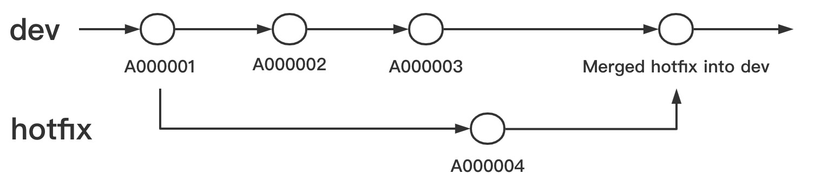
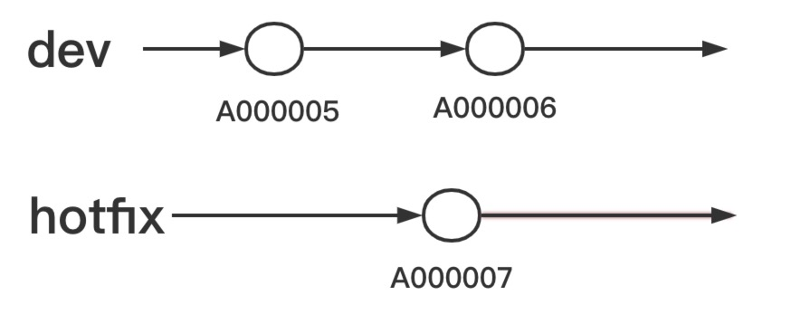

## 前言

想了想工作两年中自己做的事情，发现这方面还算不错，所以拎出来说说自己对 git 的一些理解。

粗略浏览了一下网上存在的 Git 相关的中文文章，大多数是介绍 Git 的一些命令怎么使用，或者是介绍 Git 分支管理策略里有哪些类型的分支，似乎没有一篇文章是在解释为什么要这么做。

我想从这个角度来写一篇文章，记录 Git 分支管理里那些最本质的思想，如果在学习过程中能够直观性了解到这个层面，在学习任何东西时，都会有事倍功半的效果吧。

## 为什么有 hotfix 分支

我们先来看看为什么有 `HOTFIX` 分支

假设我们只有一条分支 `dev`，最新的提交记录是 `A000001`，以该提交记录打了一个 tag `1.0`，然后我们基于这个节点的版本发布了系统。

我们继续在 `dev` 分支上继续开发，有了 `A000002`、`A000003` 两个新的提交记录，在这个时候**线上系统发现了一个 BUG ，我们要如何修复？**

如果是单独的一个 `dev` 分支，我们可以回滚到 `A000001` 这个时候的版本修复 BUG，提交记录为 `A000004`，然后部署生产版本。**那么此时就有一个问题，`A000002` 和 `A000003` 的提交记录就会被丢掉了，怎么办？**

（PS：写这篇文章的时候没有实际测试过，所以不知道这种情况的这两个分支会如何处理，下次一定先测试）

所以对于线上 BUG，分支管理策略里采取的是基于生产分支创建一个分支（一般取前缀 `hotfix-`），然后基于该分支修复 BUG 并提交，再基于这个最新的提交记录 `A000004` 发布系统，将 `hotfix` 分支合并到 `dev` 分支里，这样就不会影响后来开发的 `A000002`、`A000003` 上的功能了。这个时候的提交记录应该是这样的：

## 为什么有 master/pro 分支

如果是一个分支管理所有版本，上面我们合并 `hotfix` 分支到 `dev` 后，就把它删掉。这个时候，线上又发现了一个 BUG，我们又得修复，我们怎么创建新的 `hotfix` 分支？如果从 `A000001` 创建，那我们丢了 `A000004` 里修复的代码，如果从 `dev` 创建，那会将正在开发中的 `A000002` 和 `A000003` 也发到线上，造成线上环境存在着不需要的代码，所以呢，我们得有一个分支来对应线上环境，所以就有了 `master`/`pro` 分支，对应的是线上环境的代码。

## 为什么要合并 hotfix 分支两次

### 为什么要有分支合并操作

参看[图1](#photo1)，我们可以知道，分支一旦被切出来以后，两个分支未来的发展是相互独立的，除非是将两个分支合并。所以为了保证代码的完整性，在非环境对应分支（如：`dev`、`master` 等）下开发的代码，需要合并至环境对应的分支里，一般采取的是，从哪切出来的分支，最后合并到哪个分支中去。

### 为什么从 master 切 hotifx 分支

在有了 `master` 及 `dev` 分支分别对应 `线上环境` 及 `开发环境` 后，我们修复线上 BUG 就得从 `master` 分支上切出 `hotfix` 分支来进行修复，如果这个时候我们也可以回滚 `dev` 分支切出 `hotfix` 分支也是可以的，但是从 `master` 切分支明显更快更方便。

### 为什么要合并 hotfix 分支到 dev 分支

在理解了为什么要进行合并操作以后，在 `hotfix` 分支修复了 BUG 以后，就会将代码合并回 `master` 分支，准备部署发版，那为什么要将 `hotfix` 分支合并到 `dev` 中？

这一步的操作，更多的是保证 `dev` 的代码跟 `master` 一致，避免未来合并 `dev` 分支到 `master` 时，产生代码冲突。

## 为什么会产生冲突

如上图，合并时产生冲突我们可以简单的理解为：假如在 `A000006` 和 `A000007` 两次记录中，都对 `文件A` 的 `line: 2` 进行过修改，这个时候我们将 `hotfix` 合并至 `dev` 中，git 不知道我们应该保留两个提交记录中的哪一个版本，所以提示我们有冲突，需要我们来选择一个版本的记录保留下来。

### 修复冲突

简单的冲突我们可以选择 `accept current`、`accept incoming` 或 `accept both`中的一种方式，分别是保留 `当前分支的代码`、`合并进来的分支中的代码` 和 `两个分支中的版本都保留`。

- 当前分支：在控制台输入 `git merge` 命令时的分支，GitLab 上的 `target branch`
- 合并进来的分支：`git merge` 命令后的分支，GitLab 上的 `source branch`

## 结语

本文是某一次自己突然想到为什么要有 `master` 分支来对应生产环境，因为我们项目会在 `master` 分支上打 `tag`，我就想，在 `dev` 上打也是可以的，为什么要这样做，于是有了写下这篇文章的念头。

之所以写下这篇文章，也是因为想把这种思考的点分享出来，让其他学起来没那么快，或者对 git 分支管理有疑问的人，有一个了解途径。

后面会继续写一些这类的心里活动，如果你觉得喜欢点个赞再走吧，如果有其他想要了解的部分，欢迎评论留言。